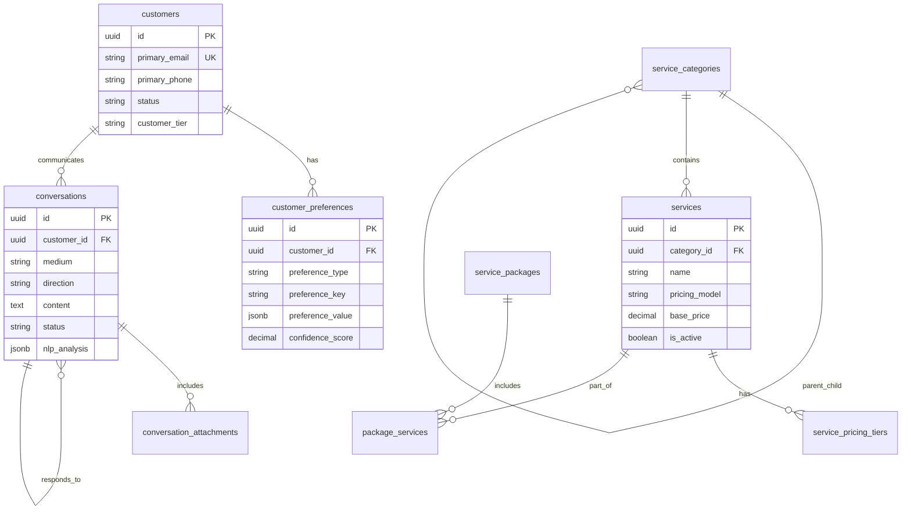

# Comprehensive Database Schemas Design

## Overview
This document defines the complete database schemas for the Karen AI Secretary system, including customer preferences, conversation history, and service catalog. The design supports both SQL (PostgreSQL) and NoSQL (Firestore) implementations.

## 1. Customer Preferences Schema

### 1.1 customer_preferences Table (SQL)

```sql
CREATE TABLE customer_preferences (
    id UUID PRIMARY KEY DEFAULT gen_random_uuid(),
    customer_id UUID NOT NULL REFERENCES customers(id) ON DELETE CASCADE,
    preference_type VARCHAR(50) NOT NULL,
    preference_key VARCHAR(100) NOT NULL,
    preference_value JSONB NOT NULL,
    confidence_score DECIMAL(3,2) DEFAULT 0.0 CHECK (confidence_score BETWEEN 0.0 AND 1.0),
    source VARCHAR(50) NOT NULL, -- 'explicit', 'learned', 'inferred', 'default'
    medium VARCHAR(20), -- 'email', 'sms', 'voice', 'general'
    context JSONB, -- Additional context data
    learned_from_interaction_id UUID REFERENCES conversations(id),
    learned_at TIMESTAMP WITH TIME ZONE DEFAULT CURRENT_TIMESTAMP,
    expires_at TIMESTAMP WITH TIME ZONE,
    is_active BOOLEAN DEFAULT true,
    priority INTEGER DEFAULT 1, -- 1=highest, 5=lowest
    created_at TIMESTAMP WITH TIME ZONE DEFAULT CURRENT_TIMESTAMP,
    updated_at TIMESTAMP WITH TIME ZONE DEFAULT CURRENT_TIMESTAMP,
    created_by VARCHAR(50) DEFAULT 'system',
    updated_by VARCHAR(50) DEFAULT 'system',
    
    UNIQUE(customer_id, preference_type, preference_key, medium)
);

-- Indexes for customer preferences
CREATE INDEX idx_customer_preferences_customer_id ON customer_preferences(customer_id);
CREATE INDEX idx_customer_preferences_type ON customer_preferences(preference_type);
CREATE INDEX idx_customer_preferences_active ON customer_preferences(is_active);
CREATE INDEX idx_customer_preferences_medium ON customer_preferences(medium);
CREATE INDEX idx_customer_preferences_confidence ON customer_preferences(confidence_score DESC);
CREATE INDEX idx_customer_preferences_priority ON customer_preferences(priority);
```

### 1.2 Customer Preferences Types and Values

```yaml
# Communication Preferences
communication_method:
  preferred_channel: "email" | "sms" | "voice" | "any"
  secondary_channel: "email" | "sms" | "voice" | "none"
  avoid_channels: ["sms", "voice"] # Array of channels to avoid
  response_urgency: "immediate" | "within_hour" | "within_day" | "flexible"
  business_hours_only: true | false
  timezone: "America/New_York"

# Scheduling Preferences  
scheduling:
  preferred_days: ["monday", "tuesday", "wednesday", "thursday", "friday"]
  avoided_days: ["saturday", "sunday"]
  preferred_times: {start: "09:00", end: "17:00"}
  lead_time_preference: "same_day" | "next_day" | "week_advance" | "flexible"
  appointment_duration_preference: "short" | "standard" | "extended"
  reminder_preferences: {
    enabled: true,
    advance_notice: "24_hours" | "2_hours" | "30_minutes",
    method: "email" | "sms" | "both"
  }

# Service Preferences
service:
  preferred_technician: "tech_001" # Reference to technician ID
  service_history: ["plumbing", "electrical", "general_repair"]
  property_type: "residential" | "commercial" | "rental"
  property_access: "key_available" | "must_be_present" | "lockbox"
  special_requirements: ["pet_friendly", "quiet_work", "no_chemicals"]
  budget_range: {min: 100, max: 500, currency: "USD"}

# Communication Style Preferences
communication_style:
  formality_level: "formal" | "professional" | "casual" | "friendly"
  detail_level: "brief" | "standard" | "detailed"
  technical_level: "simple" | "moderate" | "technical"
  emoji_usage: "none" | "minimal" | "moderate" | "frequent"
  language: "en" | "es" | "fr"

# Emergency Preferences
emergency:
  emergency_contact: {phone: "+1234567890", relationship: "spouse"}
  escalation_threshold: "immediate" | "30_minutes" | "1_hour"
  notification_method: "call" | "sms" | "email" | "all"
  after_hours_contact: true | false

# Billing Preferences
billing:
  preferred_payment_method: "credit_card" | "check" | "cash" | "invoice"
  billing_frequency: "per_service" | "monthly" | "quarterly"
  invoice_delivery: "email" | "mail" | "text"
  auto_pay_enabled: true | false
  billing_contact: "primary" | "alternate"
```

### 1.3 Firestore Customer Preferences Structure

```javascript
// customers/{customer_id}/preferences/{preference_id}
{
  id: "pref_communication_001",
  customer_id: "customer_123",
  preference_type: "communication_method",
  preference_key: "preferred_channel", 
  preference_value: {
    value: "email",
    metadata: {
      fallback: "sms",
      business_hours_only: true
    }
  },
  confidence_score: 0.85,
  source: "learned",
  medium: "general",
  context: {
    learned_from_pattern: "always responds to email within 2 hours",
    interaction_count: 15,
    success_rate: 0.93
  },
  learned_from_interaction_id: "conv_456",
  learned_at: "2025-06-04T23:30:00Z",
  expires_at: null,
  is_active: true,
  priority: 1,
  created_at: "2025-06-04T23:30:00Z",
  updated_at: "2025-06-04T23:30:00Z",
  created_by: "system",
  updated_by: "system"
}
```

## 2. Conversation History Schema

### 2.1 conversations Table (SQL)

```sql
CREATE TABLE conversations (
    id UUID PRIMARY KEY DEFAULT gen_random_uuid(),
    customer_id UUID NOT NULL REFERENCES customers(id) ON DELETE CASCADE,
    conversation_thread_id VARCHAR(255), -- Groups related messages
    external_id VARCHAR(255), -- Message ID from external system (Gmail, Twilio)
    
    -- Message Details
    medium VARCHAR(20) NOT NULL, -- 'email', 'sms', 'voice', 'chat'
    direction VARCHAR(10) NOT NULL, -- 'inbound', 'outbound'
    subject VARCHAR(500),
    content TEXT NOT NULL,
    content_type VARCHAR(50) DEFAULT 'text/plain',
    raw_content JSONB, -- Original message data
    
    -- Contact Information
    from_address VARCHAR(255),
    to_address VARCHAR(255),
    cc_addresses TEXT[], 
    bcc_addresses TEXT[],
    phone_number VARCHAR(20),
    
    -- Processing Status
    status VARCHAR(50) DEFAULT 'received', -- 'received', 'processing', 'processed', 'replied', 'failed'
    processing_stage VARCHAR(50), -- 'nlp_analysis', 'intent_classification', 'response_generation'
    
    -- NLP Analysis Results
    nlp_analysis JSONB, -- Full NLP analysis results
    intent VARCHAR(100),
    sentiment VARCHAR(20),
    priority VARCHAR(20),
    confidence_score DECIMAL(3,2),
    entities JSONB, -- Extracted entities
    keywords TEXT[],
    topics TEXT[],
    
    -- Response Information
    response_id UUID REFERENCES conversations(id), -- Links to outbound response
    response_template_used VARCHAR(100),
    response_generated_at TIMESTAMP WITH TIME ZONE,
    response_method VARCHAR(20), -- 'template', 'llm', 'human'
    
    -- Timing
    message_timestamp TIMESTAMP WITH TIME ZONE NOT NULL,
    received_at TIMESTAMP WITH TIME ZONE DEFAULT CURRENT_TIMESTAMP,
    processed_at TIMESTAMP WITH TIME ZONE,
    
    -- Metadata
    metadata JSONB,
    agent_id VARCHAR(50), -- Which agent processed this
    session_id VARCHAR(255), -- Groups conversations in a session
    
    -- Tracking
    created_at TIMESTAMP WITH TIME ZONE DEFAULT CURRENT_TIMESTAMP,
    updated_at TIMESTAMP WITH TIME ZONE DEFAULT CURRENT_TIMESTAMP,
    
    -- Constraints
    CHECK (direction IN ('inbound', 'outbound')),
    CHECK (medium IN ('email', 'sms', 'voice', 'chat', 'webhook')),
    CHECK (confidence_score IS NULL OR confidence_score BETWEEN 0.0 AND 1.0)
);

-- Indexes for conversations
CREATE INDEX idx_conversations_customer_id ON conversations(customer_id);
CREATE INDEX idx_conversations_thread_id ON conversations(conversation_thread_id);
CREATE INDEX idx_conversations_external_id ON conversations(external_id);
CREATE INDEX idx_conversations_medium ON conversations(medium);
CREATE INDEX idx_conversations_direction ON conversations(direction);
CREATE INDEX idx_conversations_status ON conversations(status);
CREATE INDEX idx_conversations_intent ON conversations(intent);
CREATE INDEX idx_conversations_timestamp ON conversations(message_timestamp DESC);
CREATE INDEX idx_conversations_session ON conversations(session_id);
CREATE INDEX idx_conversations_response ON conversations(response_id);

-- Composite indexes for common queries
CREATE INDEX idx_conversations_customer_medium_time ON conversations(customer_id, medium, message_timestamp DESC);
CREATE INDEX idx_conversations_status_priority ON conversations(status, priority);
```

### 2.2 conversation_attachments Table (SQL)

```sql
CREATE TABLE conversation_attachments (
    id UUID PRIMARY KEY DEFAULT gen_random_uuid(),
    conversation_id UUID NOT NULL REFERENCES conversations(id) ON DELETE CASCADE,
    file_name VARCHAR(255) NOT NULL,
    file_type VARCHAR(100),
    file_size INTEGER,
    storage_path VARCHAR(500),
    content_id VARCHAR(255), -- For email inline attachments
    is_inline BOOLEAN DEFAULT false,
    checksum VARCHAR(64),
    virus_scan_status VARCHAR(20) DEFAULT 'pending',
    virus_scan_result JSONB,
    created_at TIMESTAMP WITH TIME ZONE DEFAULT CURRENT_TIMESTAMP,
    
    CHECK (file_size >= 0)
);

CREATE INDEX idx_attachments_conversation_id ON conversation_attachments(conversation_id);
CREATE INDEX idx_attachments_file_type ON conversation_attachments(file_type);
```

### 2.3 Firestore Conversation Structure

```javascript
// conversations/{conversation_id}
{
  id: "conv_20250604_230015_001",
  customer_id: "customer_123",
  conversation_thread_id: "thread_email_001",
  external_id: "gmail_message_id_456",
  
  // Message Details
  medium: "email",
  direction: "inbound", 
  subject: "Need help with leaky faucet",
  content: "Hi, I have a leaky faucet in my kitchen...",
  content_type: "text/plain",
  raw_content: {
    headers: {...},
    body: "...",
    attachments: [...]
  },
  
  // Contact Info
  from_address: "customer@example.com",
  to_address: "hello@757handy.com",
  cc_addresses: [],
  phone_number: null,
  
  // Processing
  status: "processed",
  processing_stage: "completed",
  
  // NLP Analysis
  nlp_analysis: {
    intent: "service_request",
    sentiment: "neutral",
    priority: "normal",
    confidence_score: 0.92,
    entities: [
      {type: "location", value: "kitchen"},
      {type: "issue", value: "leaky faucet"}
    ],
    keywords: ["faucet", "leak", "kitchen", "repair"],
    topics: ["plumbing", "maintenance"]
  },
  
  // Response Info
  response_id: "conv_20250604_230020_002",
  response_template_used: "service_inquiry_response",
  response_generated_at: "2025-06-04T23:00:20Z",
  response_method: "template",
  
  // Timing
  message_timestamp: "2025-06-04T23:00:15Z",
  received_at: "2025-06-04T23:00:16Z", 
  processed_at: "2025-06-04T23:00:18Z",
  
  // Metadata
  metadata: {
    ip_address: "192.168.1.1",
    user_agent: "...",
    processing_time_ms: 2500
  },
  agent_id: "communication_agent",
  session_id: "session_20250604_001",
  
  created_at: "2025-06-04T23:00:16Z",
  updated_at: "2025-06-04T23:00:20Z"
}

// conversations/{conversation_id}/attachments/{attachment_id}
{
  id: "attach_001",
  conversation_id: "conv_20250604_230015_001",
  file_name: "kitchen_faucet.jpg",
  file_type: "image/jpeg",
  file_size: 1024576,
  storage_path: "gs://karen-attachments/2025/06/04/kitchen_faucet.jpg",
  content_id: "image001",
  is_inline: false,
  checksum: "sha256:abc123...",
  virus_scan_status: "clean",
  virus_scan_result: {
    scanned_at: "2025-06-04T23:00:17Z",
    engine: "clamav",
    result: "clean"
  },
  created_at: "2025-06-04T23:00:16Z"
}
```

## 3. Service Catalog Schema

### 3.1 service_categories Table (SQL)

```sql
CREATE TABLE service_categories (
    id UUID PRIMARY KEY DEFAULT gen_random_uuid(),
    name VARCHAR(100) NOT NULL UNIQUE,
    slug VARCHAR(100) NOT NULL UNIQUE,
    description TEXT,
    parent_category_id UUID REFERENCES service_categories(id),
    icon_url VARCHAR(500),
    sort_order INTEGER DEFAULT 0,
    is_active BOOLEAN DEFAULT true,
    seo_title VARCHAR(200),
    seo_description TEXT,
    created_at TIMESTAMP WITH TIME ZONE DEFAULT CURRENT_TIMESTAMP,
    updated_at TIMESTAMP WITH TIME ZONE DEFAULT CURRENT_TIMESTAMP
);

CREATE INDEX idx_service_categories_parent ON service_categories(parent_category_id);
CREATE INDEX idx_service_categories_active ON service_categories(is_active);
CREATE INDEX idx_service_categories_sort ON service_categories(sort_order);
```

### 3.2 services Table (SQL)

```sql
CREATE TABLE services (
    id UUID PRIMARY KEY DEFAULT gen_random_uuid(),
    category_id UUID NOT NULL REFERENCES service_categories(id),
    
    -- Basic Information
    name VARCHAR(200) NOT NULL,
    slug VARCHAR(200) NOT NULL UNIQUE,
    short_description VARCHAR(500),
    full_description TEXT,
    
    -- Pricing Information
    pricing_model VARCHAR(50) NOT NULL, -- 'fixed', 'hourly', 'estimate', 'tiered'
    base_price DECIMAL(10,2),
    hourly_rate DECIMAL(10,2),
    minimum_charge DECIMAL(10,2),
    maximum_charge DECIMAL(10,2),
    currency VARCHAR(3) DEFAULT 'USD',
    
    -- Service Details
    estimated_duration_minutes INTEGER,
    difficulty_level INTEGER CHECK (difficulty_level BETWEEN 1 AND 5),
    requires_permit BOOLEAN DEFAULT false,
    emergency_service BOOLEAN DEFAULT false,
    warranty_period_days INTEGER DEFAULT 90,
    
    -- Availability
    is_active BOOLEAN DEFAULT true,
    is_featured BOOLEAN DEFAULT false,
    availability_zones TEXT[], -- Geographic areas where service is available
    seasonal_availability JSONB, -- Specific seasons/months when available
    
    -- Requirements and Dependencies
    required_skills TEXT[],
    required_tools TEXT[],
    required_materials TEXT[],
    prerequisites TEXT[], -- Other services that must be completed first
    
    -- SEO and Marketing
    seo_title VARCHAR(200),
    seo_description TEXT,
    keywords TEXT[],
    image_urls TEXT[],
    
    -- Metadata
    metadata JSONB,
    created_at TIMESTAMP WITH TIME ZONE DEFAULT CURRENT_TIMESTAMP,
    updated_at TIMESTAMP WITH TIME ZONE DEFAULT CURRENT_TIMESTAMP,
    created_by VARCHAR(50) DEFAULT 'system',
    updated_by VARCHAR(50) DEFAULT 'system',
    
    CHECK (pricing_model IN ('fixed', 'hourly', 'estimate', 'tiered')),
    CHECK (base_price >= 0 OR base_price IS NULL),
    CHECK (hourly_rate >= 0 OR hourly_rate IS NULL),
    CHECK (minimum_charge >= 0 OR minimum_charge IS NULL),
    CHECK (estimated_duration_minutes > 0 OR estimated_duration_minutes IS NULL)
);

-- Indexes for services
CREATE INDEX idx_services_category ON services(category_id);
CREATE INDEX idx_services_active ON services(is_active);
CREATE INDEX idx_services_featured ON services(is_featured);
CREATE INDEX idx_services_emergency ON services(emergency_service);
CREATE INDEX idx_services_pricing_model ON services(pricing_model);
CREATE INDEX idx_services_difficulty ON services(difficulty_level);
CREATE INDEX idx_services_availability_zones ON services USING GIN(availability_zones);
CREATE INDEX idx_services_keywords ON services USING GIN(keywords);
```

### 3.3 service_pricing_tiers Table (SQL)

```sql
CREATE TABLE service_pricing_tiers (
    id UUID PRIMARY KEY DEFAULT gen_random_uuid(),
    service_id UUID NOT NULL REFERENCES services(id) ON DELETE CASCADE,
    tier_name VARCHAR(100) NOT NULL,
    tier_description TEXT,
    min_quantity INTEGER DEFAULT 1,
    max_quantity INTEGER,
    price DECIMAL(10,2) NOT NULL,
    unit VARCHAR(50), -- 'each', 'hour', 'sqft', 'linear_ft'
    is_default BOOLEAN DEFAULT false,
    sort_order INTEGER DEFAULT 0,
    created_at TIMESTAMP WITH TIME ZONE DEFAULT CURRENT_TIMESTAMP,
    
    CHECK (price >= 0),
    CHECK (min_quantity >= 0),
    CHECK (max_quantity IS NULL OR max_quantity >= min_quantity)
);

CREATE INDEX idx_pricing_tiers_service ON service_pricing_tiers(service_id);
CREATE INDEX idx_pricing_tiers_default ON service_pricing_tiers(is_default);
```

### 3.4 service_packages Table (SQL)

```sql
CREATE TABLE service_packages (
    id UUID PRIMARY KEY DEFAULT gen_random_uuid(),
    name VARCHAR(200) NOT NULL,
    slug VARCHAR(200) NOT NULL UNIQUE,
    description TEXT,
    package_type VARCHAR(50) DEFAULT 'bundle', -- 'bundle', 'maintenance', 'seasonal'
    
    -- Pricing
    total_price DECIMAL(10,2) NOT NULL,
    savings_amount DECIMAL(10,2) DEFAULT 0,
    currency VARCHAR(3) DEFAULT 'USD',
    
    -- Package Details
    estimated_duration_hours DECIMAL(4,2),
    validity_period_days INTEGER DEFAULT 365,
    max_uses INTEGER, -- For maintenance packages
    
    -- Status
    is_active BOOLEAN DEFAULT true,
    is_featured BOOLEAN DEFAULT false,
    available_from DATE,
    available_until DATE,
    
    -- Metadata
    terms_and_conditions TEXT,
    image_urls TEXT[],
    created_at TIMESTAMP WITH TIME ZONE DEFAULT CURRENT_TIMESTAMP,
    updated_at TIMESTAMP WITH TIME ZONE DEFAULT CURRENT_TIMESTAMP,
    
    CHECK (total_price >= 0),
    CHECK (savings_amount >= 0),
    CHECK (estimated_duration_hours > 0 OR estimated_duration_hours IS NULL)
);

CREATE INDEX idx_packages_active ON service_packages(is_active);
CREATE INDEX idx_packages_featured ON service_packages(is_featured);
CREATE INDEX idx_packages_availability ON service_packages(available_from, available_until);
```

### 3.5 package_services Table (SQL)

```sql
CREATE TABLE package_services (
    id UUID PRIMARY KEY DEFAULT gen_random_uuid(),
    package_id UUID NOT NULL REFERENCES service_packages(id) ON DELETE CASCADE,
    service_id UUID NOT NULL REFERENCES services(id) ON DELETE CASCADE,
    quantity INTEGER DEFAULT 1,
    included_price DECIMAL(10,2),
    is_optional BOOLEAN DEFAULT false,
    sort_order INTEGER DEFAULT 0,
    notes TEXT,
    
    UNIQUE(package_id, service_id),
    CHECK (quantity > 0),
    CHECK (included_price >= 0 OR included_price IS NULL)
);

CREATE INDEX idx_package_services_package ON package_services(package_id);
CREATE INDEX idx_package_services_service ON package_services(service_id);
```

### 3.6 Firestore Service Catalog Structure

```javascript
// service_categories/{category_id}
{
  id: "cat_plumbing",
  name: "Plumbing Services",
  slug: "plumbing-services",
  description: "Complete plumbing services for residential and commercial properties",
  parent_category_id: null,
  icon_url: "https://example.com/icons/plumbing.svg",
  sort_order: 1,
  is_active: true,
  seo_title: "Professional Plumbing Services | 757 Handy",
  seo_description: "Expert plumbing services in Virginia Beach...",
  created_at: "2025-06-04T23:30:00Z",
  updated_at: "2025-06-04T23:30:00Z"
}

// services/{service_id}
{
  id: "service_faucet_repair",
  category_id: "cat_plumbing",
  
  // Basic Info
  name: "Faucet Repair & Replacement",
  slug: "faucet-repair-replacement",
  short_description: "Fix leaky faucets, replace old fixtures",
  full_description: "Complete faucet repair and replacement services...",
  
  // Pricing
  pricing_model: "tiered",
  base_price: 85.00,
  hourly_rate: null,
  minimum_charge: 85.00,
  maximum_charge: 350.00,
  currency: "USD",
  
  // Service Details
  estimated_duration_minutes: 120,
  difficulty_level: 2,
  requires_permit: false,
  emergency_service: true,
  warranty_period_days: 90,
  
  // Availability
  is_active: true,
  is_featured: false,
  availability_zones: ["virginia_beach", "norfolk", "chesapeake"],
  seasonal_availability: null,
  
  // Requirements
  required_skills: ["plumbing_basic", "tool_usage"],
  required_tools: ["wrench_set", "pliers", "pipe_tape"],
  required_materials: ["faucet_parts", "sealant"],
  prerequisites: [],
  
  // SEO
  seo_title: "Faucet Repair Service | Fast & Reliable | 757 Handy",
  seo_description: "Professional faucet repair and replacement...",
  keywords: ["faucet repair", "leaky faucet", "plumbing", "virginia beach"],
  image_urls: [
    "https://example.com/images/faucet-repair-1.jpg",
    "https://example.com/images/faucet-repair-2.jpg"
  ],
  
  // Metadata
  metadata: {
    popular_brands: ["Moen", "Delta", "Kohler"],
    common_issues: ["dripping", "low_pressure", "handle_broken"],
    tools_provided: true
  },
  
  created_at: "2025-06-04T23:30:00Z",
  updated_at: "2025-06-04T23:30:00Z",
  created_by: "admin",
  updated_by: "admin"
}

// services/{service_id}/pricing_tiers/{tier_id}
{
  id: "tier_basic_repair",
  service_id: "service_faucet_repair",
  tier_name: "Basic Repair",
  tier_description: "Minor repairs, washer replacement",
  min_quantity: 1,
  max_quantity: 1,
  price: 85.00,
  unit: "each",
  is_default: true,
  sort_order: 1,
  created_at: "2025-06-04T23:30:00Z"
}

// service_packages/{package_id}
{
  id: "package_kitchen_refresh",
  name: "Kitchen Plumbing Refresh",
  slug: "kitchen-plumbing-refresh",
  description: "Complete kitchen plumbing maintenance package",
  package_type: "bundle",
  
  // Pricing
  total_price: 275.00,
  savings_amount: 50.00,
  currency: "USD",
  
  // Details
  estimated_duration_hours: 4.5,
  validity_period_days: 365,
  max_uses: null,
  
  // Status
  is_active: true,
  is_featured: true,
  available_from: "2025-01-01",
  available_until: "2025-12-31",
  
  // Metadata
  terms_and_conditions: "Package must be used within 12 months...",
  image_urls: ["https://example.com/packages/kitchen-refresh.jpg"],
  created_at: "2025-06-04T23:30:00Z",
  updated_at: "2025-06-04T23:30:00Z"
}

// service_packages/{package_id}/services/{service_ref_id}
{
  id: "pkg_svc_001",
  package_id: "package_kitchen_refresh",
  service_id: "service_faucet_repair",
  quantity: 1,
  included_price: 85.00,
  is_optional: false,
  sort_order: 1,
  notes: "Includes up to 2 faucets"
}
```

## 4. Supporting Tables

### 4.1 customers Table (SQL)

```sql
CREATE TABLE customers (
    id UUID PRIMARY KEY DEFAULT gen_random_uuid(),
    external_id VARCHAR(255) UNIQUE, -- For integration with external systems
    
    -- Contact Information
    first_name VARCHAR(100),
    last_name VARCHAR(100), 
    company_name VARCHAR(200),
    customer_type VARCHAR(20) DEFAULT 'individual', -- 'individual', 'business'
    
    -- Primary Contact
    primary_email VARCHAR(255) UNIQUE,
    primary_phone VARCHAR(20),
    secondary_email VARCHAR(255),
    secondary_phone VARCHAR(20),
    
    -- Address Information
    billing_address JSONB,
    service_address JSONB,
    
    -- Customer Status
    status VARCHAR(20) DEFAULT 'active', -- 'active', 'inactive', 'blocked'
    customer_tier VARCHAR(20) DEFAULT 'standard', -- 'standard', 'premium', 'vip'
    
    -- Preferences Summary (computed from customer_preferences table)
    preferred_contact_method VARCHAR(20),
    preferred_contact_time VARCHAR(50),
    communication_style VARCHAR(20),
    
    -- Business Information
    referral_source VARCHAR(100),
    customer_since DATE DEFAULT CURRENT_DATE,
    lifetime_value DECIMAL(10,2) DEFAULT 0,
    total_jobs INTEGER DEFAULT 0,
    
    -- Metadata
    notes TEXT,
    tags TEXT[],
    metadata JSONB,
    
    -- Tracking
    created_at TIMESTAMP WITH TIME ZONE DEFAULT CURRENT_TIMESTAMP,
    updated_at TIMESTAMP WITH TIME ZONE DEFAULT CURRENT_TIMESTAMP,
    last_contact_at TIMESTAMP WITH TIME ZONE,
    
    CHECK (customer_type IN ('individual', 'business')),
    CHECK (status IN ('active', 'inactive', 'blocked')),
    CHECK (customer_tier IN ('standard', 'premium', 'vip')),
    CHECK (lifetime_value >= 0)
);

-- Indexes for customers
CREATE INDEX idx_customers_email ON customers(primary_email);
CREATE INDEX idx_customers_phone ON customers(primary_phone);
CREATE INDEX idx_customers_status ON customers(status);
CREATE INDEX idx_customers_tier ON customers(customer_tier);
CREATE INDEX idx_customers_type ON customers(customer_type);
CREATE INDEX idx_customers_since ON customers(customer_since);
CREATE INDEX idx_customers_tags ON customers USING GIN(tags);
CREATE INDEX idx_customers_contact_method ON customers(preferred_contact_method);
```

## 5. Database Relationships and Constraints

### 5.1 Key Relationships



## 6. Data Access Patterns and Indexes

### 6.1 Common Query Patterns

```sql
-- Customer preference lookup
SELECT * FROM customer_preferences 
WHERE customer_id = ? AND preference_type = ? AND is_active = true
ORDER BY priority, confidence_score DESC;

-- Conversation history for customer
SELECT * FROM conversations 
WHERE customer_id = ? AND medium = ?
ORDER BY message_timestamp DESC 
LIMIT 50;

-- Service search with pricing
SELECT s.*, sc.name as category_name, spt.price
FROM services s
JOIN service_categories sc ON s.category_id = sc.id
LEFT JOIN service_pricing_tiers spt ON s.id = spt.service_id AND spt.is_default = true
WHERE s.is_active = true 
AND s.keywords && ?::text[]
ORDER BY s.is_featured DESC, s.name;

-- Customer communication analytics
SELECT 
    medium,
    COUNT(*) as message_count,
    AVG(CASE WHEN direction = 'inbound' THEN 1 ELSE 0 END) as response_rate
FROM conversations 
WHERE customer_id = ? 
AND message_timestamp >= NOW() - INTERVAL '30 days'
GROUP BY medium;
```

### 6.2 Firestore Query Patterns

```javascript
// Get active preferences for customer
db.collection('customers')
  .doc(customerId)
  .collection('preferences')
  .where('is_active', '==', true)
  .where('preference_type', '==', 'communication_method')
  .orderBy('priority')
  .orderBy('confidence_score', 'desc')
  .get()

// Get recent conversations
db.collection('conversations')
  .where('customer_id', '==', customerId)
  .where('medium', '==', 'email')
  .orderBy('message_timestamp', 'desc')
  .limit(50)
  .get()

// Search services by category
db.collection('services')
  .where('category_id', '==', categoryId)
  .where('is_active', '==', true)
  .orderBy('is_featured', 'desc')
  .orderBy('name')
  .get()
```

This comprehensive database schema design provides a robust foundation for the Karen AI Secretary system, supporting customer relationship management, intelligent conversation tracking, and a flexible service catalog structure.